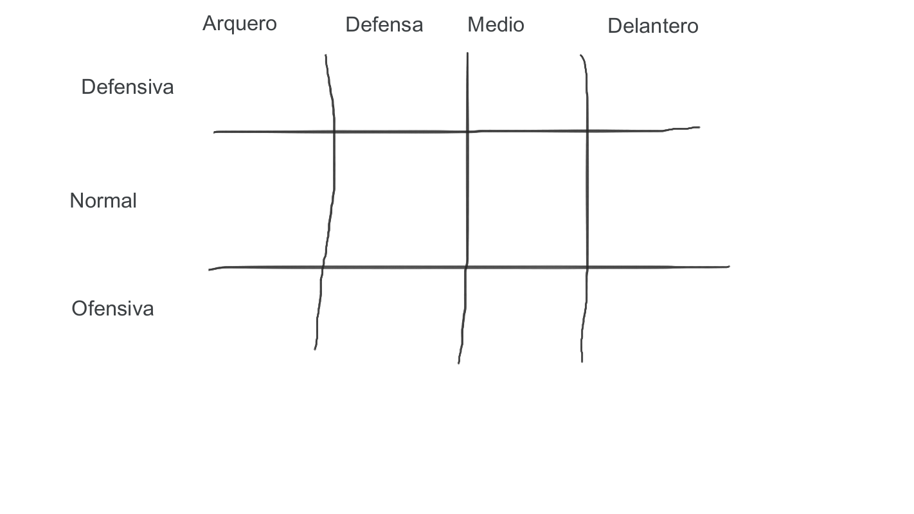

# Abstract Factory
Nos permite producir familias de objectos relacionados sin especificar su clase concreta.

## Como implementarlo

1. Haga una matriz entre los diferentes tipos de objectos versus las variantes de estos objetos.

2. Declare interfaces* abstractas por todos los tipos de objectos, después haga clases concretas para estos objectos implementado estas interfaces. 

    > En Ruby no existen **interfaces** como si existen en otros lenguaje de programación.
    **Interfaz** Es una especie de contrato que una clase se compromete a cumplir al implementar dica interfaz. Este contrato está dado por una colección de métodos abstractos(sin definir su funcionalidad) los cuáles deben ser implementados en la clase que se adhiere a la interfaz. [source][1]

3. Declarar una abstract factory interface con un conjunto de ```creation methods``` para todos los objectos abstractos.

4. Implementar un conjunto de ```concrete factory class`, una por cada variante del objeto.

5. Crear el código de inicialización de la factory en la aplicación, este debe intanciar una de las concrete factory classes, dependiendo de la configuración de la aplicación o del ambiente. Pasar este ```factory object``` a todas las que construyan productos.

6. Revisar a traves del código y encontrar todas las llamadas directas a los constructores. Reemplazar estas con llamadas a los apropiados métodos de creación en el ```factory object```.

## Ejemplo
Vamos a implementar una generador de nominas de fútbol, un equipo debe cubrir todas las posiciones: arquero, defensa, mediocampo y delantero. El técnico (ósea el usuario) podrá elegir entre tres tipos de alineación: ofensiva, normal o defensiva.

### Paso 1

Crear la matriz:



### Paso 2

Interfaces abstractas:
- [AbstractGoalKeeper.rb](./abstractInterfaces/abstractGoalKeeper.rb)
- [AbstractDefender.rb](./abstractInterfaces/abstractDefender.rb)
- [AbstractMiddle.rb](./abstractInterfaces/abstractMiddle.rb)
- [AbstractForward.rb](./abstractInterfaces/abstractForward.rb)

Clases concretas:
- [ConcretetGoalKeeper.rb](./concreteClasses/concreteGoalKeeper.rb)
- [ConcretetDefender.rb](./concreteClasses/concreteDefender.rb)
- [ConcretetMiddle.rb](./concreteClasses/concreteMiddle.rb)
- [ConcretetForward.rb](./concreteClasses/concreteForward.rb)

### Paso 3 

Abstract Factory
- [Abstractfactory](./abstractInterfaces/abstractFactory.rb)

### Paso 4

Concrete factory classes
- [ConcreteFactoryDefensive](./concreteFactories/concreteFactoryDefensive.rb)
- [ConcreteFactoryOffensive](./concreteFactories/concreteFactoryOffensive.rb)
- [ConcreteFactoryNormal](./concreteFactories/concreteFactoryNormal.rb)


[This code is base on Refactoring Guru](https://refactoring.guru/design-patterns)

[1]: https://otroespacioblog.wordpress.com/2018/06/24/sobre-las-interfaces-en-ruby/